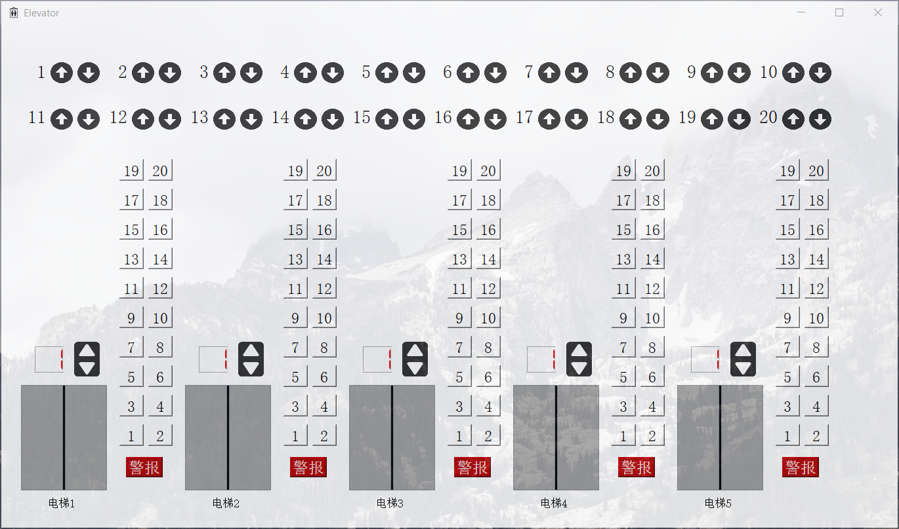
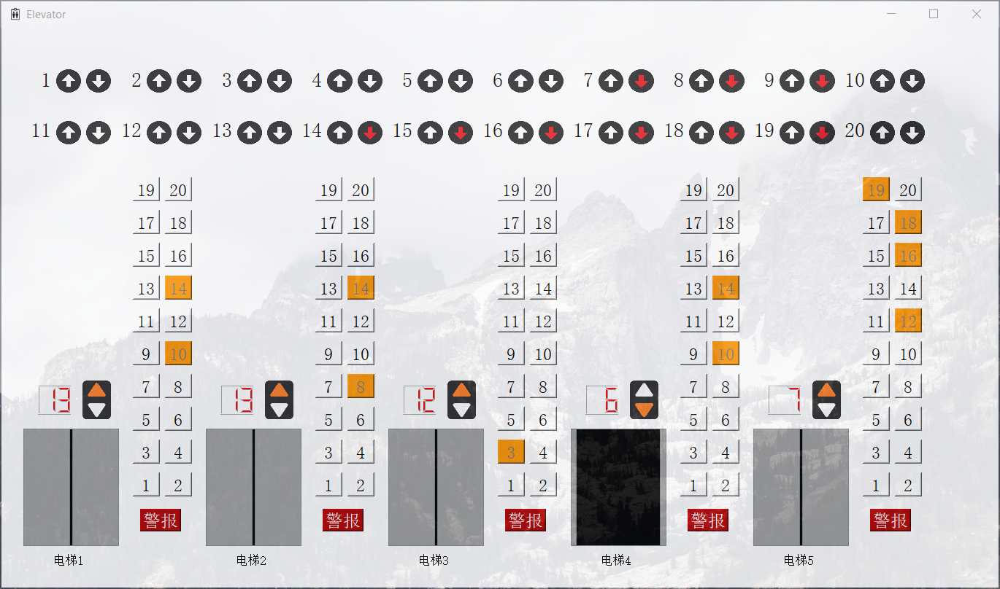
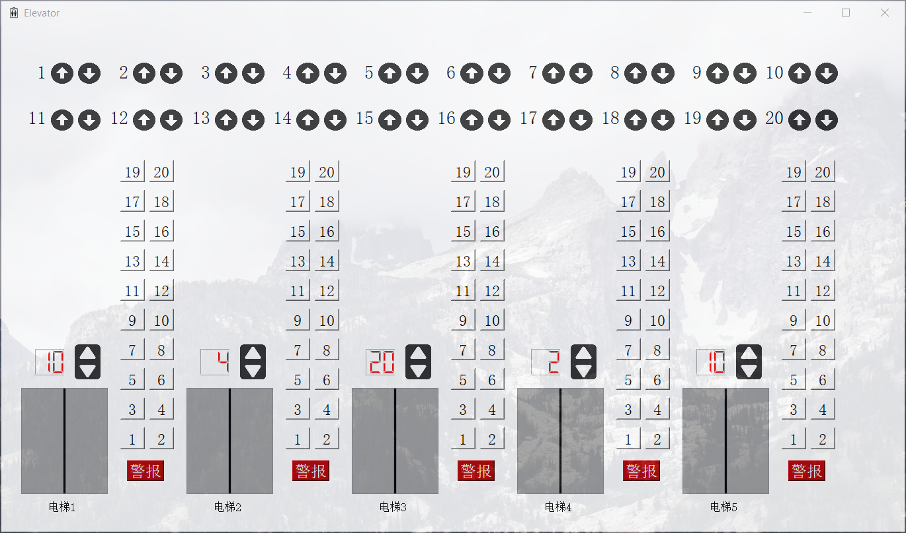
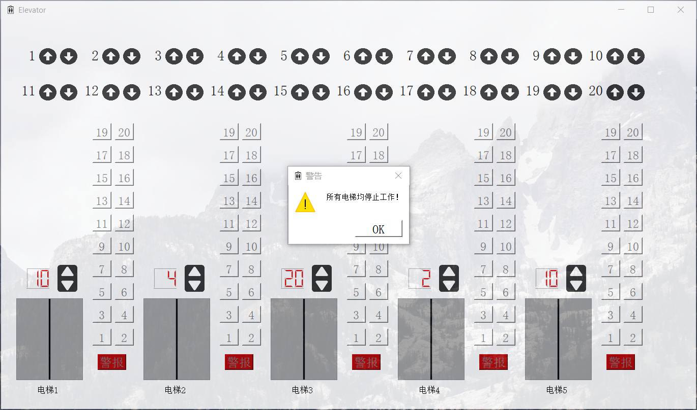

# 电梯调度模拟器

<center>任致辰 1850091</center>

## 项目简介

​	本项目为一个电梯调度模拟器，模拟在一栋20层楼中的5部电梯的调度过程。

## 开发环境

- Windows 10
- Python 3.8

​	具体Python环境可以使用requirements.txt配置。

## 运行方法

```bash
git clone https://github.com/ZhichenRen/Elevator.git
cd Elevator
cd src
pip install requirements.txt
python main.py
```

## 功能说明

​	本项目为一个电梯调度模拟器，共有5部电梯，支持如下功能。

- 内部调度
- 外部调度
- 电梯报警

​	内部调度是指乘客在电梯内部选择想要前往的楼层，外部调度是指乘客在电梯外部的某一楼层选择上行或下行。电梯警报按钮用于危险情况，按下警报按钮的电梯停止运行，其外部调度任务将被分配给其他电梯。



- 最上方的按钮为外部调度按钮
- 每部电梯旁的按钮为内部调度按钮
- 电梯上方的数字显示当前楼层
- 电梯上放的上下图标显示电梯的运行方向
- 电梯右方的红色警报按钮用于报警，暂停电梯运行

## 算法介绍

​	本项目采用了LOOK调度算法。

​	首先介绍SCAN调度算法，这是一种来回扫描的调度算法。在电梯调度这一应用场景中，电梯将在1至20层楼中不断来回移动。在此过程中，如果有内部乘客或外部乘客发出请求，电梯就会停下。

​	SCAN调度算法保证了用户能够在有限的时间内乘上电梯，但不停的来回移动不仅会让乘客白白等待，也会增加电梯的运行成本。

​	LOOK调度算法是SCAN调度算法的一种改进，在LOOK调度算法中，电梯不会在1至20楼中来回移动，而是在目前服务队列中的最高层与最底层之间来回移动。每当电梯上行到达一个停靠层时，如果服务队列中没有更高的楼层，且服务队列中还有未到达的较低楼层，电梯就会向下移动，反之亦然。

​	由于本项目涉及多台电梯的调度，在单体电梯调度算法的基础上还需要一种群体调度算法，具体如下：

​	当一名乘客在外部按下电梯时，本调度系统将挑选一个顺路且估计时间花费最小的电梯进行服务。顺路是指电梯正在向目标楼层运行，估计时间花费则考虑了电梯与目标楼层之间的楼层差以及电梯当前服务队列的长度。若所有电梯都不顺路，则将该用户请求加入等待队列中，并在电梯状态更新后重新分配任务。

## 具体实现

​	这里主要介绍单体电梯调度算法以及群体调度算法的实现思路。

​	每一部电梯会对应一个停靠队列$stop\_queue$与一个等待队列$wait\_queue$，前者按电梯运动方向排序，若电梯向上，则为升序，若电梯向下，则为降序，代表了电梯在本次单程运行中的停靠楼层。$wait\_queue$则为等待队列，用于存放被按下但不在本次单程运行中前往的楼层。

​	当一名乘客在内部按下楼层按钮时，如果前往该楼层的方向与电梯移动方向相同，目标楼层会被加入停靠队列中，否则它会被加入等待队列中。

​	当一名乘客在外部按下电梯上行或下行按钮时，系统会计算每部电梯前往该楼层的花费，$cost[i]=abs(floor_{from}[i]-floor_{to}[i])+2*len(stop\_queue[i])$，随后选取电梯移动方向朝向$floot_{to}$且$cost$最小的电梯，将$floor_{to}$加入其停靠队列中。同时，调度系统会将$floor_{to}$存放至外部调度队列中，用于警报系统触发后的调度工作。

​	当警报按钮被按下时，损坏电梯将停止运行，停在当前楼层。调度系统则会将其外部调度队列中的所有目标楼层加入全局等待队列中，在下一次更新电梯状态时重新分配调度。

​	本调度系统将记录每一部电梯的停靠队列以及等待队列，根据当前电梯楼层与下一个停靠楼层（也就是停靠队列中的第一个楼层）来判断电梯运行方向。若两者相同则电梯停靠。当电梯的停靠队列为空时，电梯将等待队列中的停靠楼层加入停靠队列中，依次循环。若电梯的停靠队列与等待队列均为空，电梯将停靠在当前楼层。

## 运行截图


<center>截图1 电梯调度模拟器</center>



<center>截图2 调度中</center>



<center>截图3 调度完成</center>



<center>截图4 所有电梯停止工作</center>

